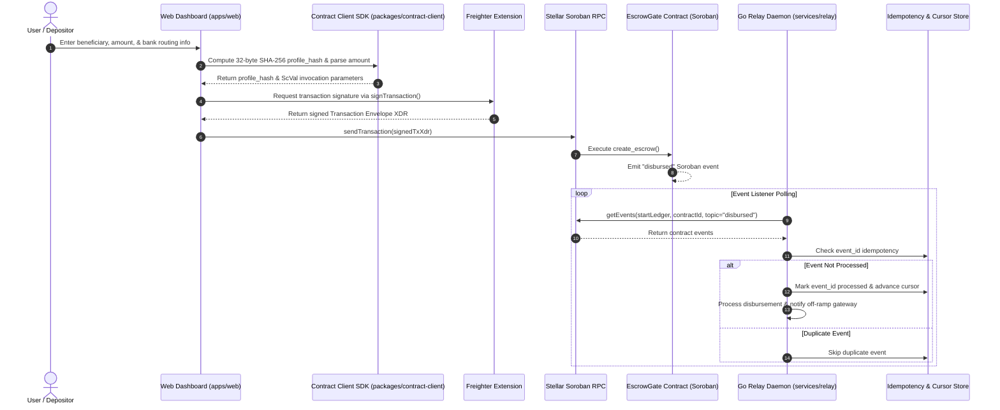

# SorobanAnchor Gate Architecture

## System Overview

SorobanAnchor Gate provides a smart-contract-backed milestone escrow and anchor off-ramp gate on the Stellar network.

## Component Boundaries

1. **Frontend (`apps/web`)**: Client-side Next.js 16 application providing wallet connection, profile hashing, fee calculation, and transaction review.
2. **Contract Client (`packages/contract-client`)**: TypeScript SDK containing integer-safe math helpers (`parseTokenAmount`, `formatTokenAmount`), profile hash computation, and typed Soroban invocation builders.
3. **Go Relay Daemon (`services/relay`)**: Long-running background daemon polling Soroban RPC for `disbursed` events, enforcing idempotency, tracking ledger cursor, and triggering anchor off-ramp execution.
