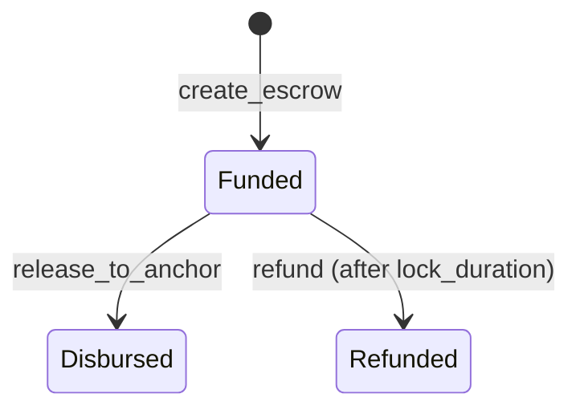

# Smart Contract Parity Specification

This document details the function, argument, type, event, and state parity between the authoritative Soroban contract repository [`Sorobo-Gate/soroban-anchor-gate-contract`](https://github.com/Sorobo-Gate/soroban-anchor-gate-contract) and this application repository (`apps/web`, `packages/contract-client`, `services/relay`).

---

## 1. Public Contract Functions & Signatures

| Function | Contract Arguments | TypeScript SDK Method (`packages/contract-client`) | Description |
|---|---|---|---|
| `init` | `admin: Address`, `treasury: Address`, `fee_bps: u32` | `buildInitTx({ admin, treasury, feeBps })` | Initializes contract admin, treasury, and fee basis points (0..10,000) |
| `create_escrow` | `payer: Address`, `beneficiary: Address`, `token: Address`, `amount: i128`, `lock_duration: u64`, `profile_hash: BytesN<32>` | `buildCreateEscrowTx({ payer, beneficiary, token, amount, lockDurationSeconds, profileHashHex })` | Locks token deposit in escrow with 32-byte profile commitment |
| `release_to_anchor` | `escrow_id: u64`, `caller: Address`, `anchor_disbursement_address: Address` | `buildReleaseToAnchorTx({ escrowId, caller, anchorDisbursementAddress })` | Releases escrow funds to anchor disbursement address |
| `refund` | `escrow_id: u64` | `buildRefundTx(escrowId)` | Refunds locked escrow to payer after lock duration expires |

---

## 2. Onchain Escrow State Lifecycle

The smart contract uses three explicit state variants:

| State Variant | Description | UI Representation |
|---|---|---|
| `Funded` | Tokens locked in escrow contract | `Funded` |
| `Disbursed` | Escrow released to anchor for off-ramp payout | `Disbursed` |
| `Refunded` | Escrow returned to depositor after timelock | `Refunded` |

> ⚠️ **State Correction**: The app previously rendered `Funded → Disbursed → Settled`. The contract contains **no `Settled` variant**. The frontend status display strictly reflects `Funded → Disbursed → Refunded`.

---

## 3. Soroban Event Specification

| Contract Event Topic | Topic XDR Symbol | Payload Type | Relay Listener Topic (`services/relay`) |
|---|---|---|---|
| `disbursed` | `[Symbol("disbursed"), u64(escrow_id)]` | `(profile_hash: BytesN<32>, payout_amount: i128)` | `disbursed` |

> ⚠️ **Event Format**: The contract emits topic `["disbursed", escrow_id]` and tuple payload `(profile_hash, payout_amount)`. The Go relay listener decodes both the topic escrow ID and the payload profile hash and i128 payout amount into `*big.Int`.

---

## 4. Numeric & Data Domain Mapping

| Data Field | Contract Type | SDK / TypeScript Type | Go Relay Type | Boundary Enforcement |
|---|---|---|---|---|
| `amount` | `i128` | `bigint` (native bigint string/int) | `*big.Int` | Integer-safe conversion; no JS floating-point for transaction construction |
| `escrow_id` | `u64` | `bigint` | `uint64` | Native unsigned 64-bit integer |
| `lock_duration` | `u64` | `bigint` | `uint64` | Seconds |
| `profile_hash` | `BytesN<32>` | `string` (64-char hex / 32 bytes) | `[32]byte` | Strictly validated 32-byte SHA-256 digest |
| `fee_bps` | `u32` | `number` | N/A | Validated range `0 <= fee_bps <= 10000` |
